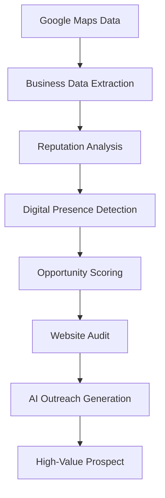
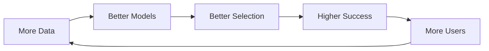

---

  

    
    {/* Left Side: Main Content */}
    

# Turning Google Maps into a Local Business Opportunity Engine

**Role** → Product Designer & Builder  
**Timeline** → 1 Week  
**Type** → AI-powered Prospect Intelligence Tool

---

# 🧠 The Idea

Local businesses are highly visible on Google Maps. But many still lack a proper digital presence — especially websites. For freelancers and digital agencies, this creates a clear opportunity.

The challenge is not demand. The challenge is **discovery**. Manual prospecting is slow, repetitive, and unstructured.

I built **MapLead AI** to convert this manual process into an intelligent system.

---

# ⚠️ The Problem

While offering website development services, my workflow looked like this:
- Search business category
- Open listings one by one
- Check for website presence
- Evaluate reviews manually
- Maintain leads in a spreadsheet

⏱️ Time taken: **2–3 hours per city**

---

# 💡 The Insight

During this process, I noticed something important: Many businesses had strong ratings and high customer engagement, but **no website**.

This meant:
> Demand exists — but digital infrastructure is missing.

---

# 🎯 The Opportunity

Google Maps is full of **untapped digital opportunities**. But there is no system that identifies businesses without websites, evaluates their potential, and helps prioritize outreach. This gap became the foundation of the product.

---

# 🧪 Product Hypothesis

If business data from Google Maps could be automatically analyzed, then we can:
→ identify high-value prospects  
→ reduce manual effort  
→ improve conversion efficiency

---

# 🚀 The Solution

MapLead AI is a lightweight system that extracts business data, analyzes reputation signals, detects digital gaps, and prioritizes opportunities. Instead of browsing listings manually, users get a **ranked list of high-potential prospects**.

---

# ⚙️ Product Intelligence Flow

This is the core engine of the product:

This transforms raw data into **actionable insights**.

---

# 🧭 Product Workflow

From user perspective:
1. **Select City / Category**
2. **Extract Business Listings**
3. **Analyze Data Automatically**
4. **View Ranked Opportunities**
5. **Audit Website (if exists)**
6. **Generate Outreach Message**

**Result: From manual search → intelligent pipeline**

---

# ✨ Key Features

### 1️⃣ Opportunity Score
Not all leads are equal. I built a system to **prioritize high-value prospects**.
- **Logic:** Businesses are scored based on website presence, rating & review volume, category demand, and contact availability.
- **Output:** A ranked list of businesses with highest conversion potential.

### 2️⃣ AI Outreach Generator
Once leads are identified, outreach becomes the bottleneck. This feature generates personalized, contextual, and ready-to-send messages based on business name, rating, reviews, and website status.

### 3️⃣ Website Audit
Not all opportunities are "no website". Some are "bad website". This feature evaluates mobile responsiveness, SEO basics, usability signals, and contact / booking availability.
- **Output:** Website Quality Score + Improvement Insights.

---

# Feature Prioritization

To focus on maximum impact, I prioritized features based on value vs effort.

| Feature | Impact | Effort | Priority |
| --- | --- | --- | --- |
| Opportunity Score | High | Low | High |
| AI Outreach Generator | High | Medium | High |
| Website Audit | Medium | Medium | Medium |
| CRM Pipeline | Medium | Medium | Medium |
| Market Analysis | Medium | Low | Medium |

👉 Focus first on **core user pain (lead discovery)**

---

# 📊 Impact

**Before:** ⏱️ 2–3 hours per city | Manual browsing | Low efficiency  
**After:** ⚡ 10–15 minutes per city | Automated discovery | Structured workflow  

👉 **~10x improvement in efficiency**

---

# ⚖️ Tradeoffs & Constraints

- **API Constraints:** Google Maps APIs have usage limits. Designed for targeted discovery, not bulk scraping.
- **AI Cost Constraints:** Limited AI usage. Focused only on high-value actions (outreach, audit).

---

# 🔁 Product Growth Loop

---

# What I Would Build Next

To evolve into a full product:
- AI website mockup generator
- Automated outreach campaigns
- Category-level market insights
- Integrated CRM system

---

# Key Learnings

- Great products often start from personal pain points.
- Small automation can create large impact.
- AI + APIs can unlock powerful workflows.
- Product thinking is about **clarity, not complexity**.

---

# What This Project Demonstrates

This project reflects core PM capabilities:
✔ Problem Discovery  
✔ Opportunity Identification  
✔ Product Strategy  
✔ Feature Prioritization  
✔ AI Integration Thinking  
✔ Workflow Optimization

---

# 🧠 Final Thought

MapLead AI is not just a tool. It is a shift from manual searching to **intelligent opportunity discovery**. It shows how simple product thinking can turn a repetitive task into a scalable system.

    {/* Right Side: Sticky Sidebar */}
    <aside className="hidden lg:block w-48 xl:w-56 shrink-0 sticky top-32 self-start h-max">
      

        
Navigation

        
        <a href="#the-idea" className="text-sm font-medium text-muted-foreground hover:text-foreground hover:translate-x-1 transition-all duration-200">The Idea</a>
        <a href="#the-problem" className="text-sm font-medium text-muted-foreground hover:text-foreground hover:translate-x-1 transition-all duration-200">The Problem</a>
        <a href="#the-insight" className="text-sm font-medium text-muted-foreground hover:text-foreground hover:translate-x-1 transition-all duration-200">The Insight</a>
        <a href="#the-opportunity" className="text-sm font-medium text-muted-foreground hover:text-foreground hover:translate-x-1 transition-all duration-200">The Opportunity</a>
        <a href="#product-hypothesis" className="text-sm font-medium text-muted-foreground hover:text-foreground hover:translate-x-1 transition-all duration-200">Product Hypothesis</a>
        <a href="#the-solution" className="text-sm font-medium text-muted-foreground hover:text-foreground hover:translate-x-1 transition-all duration-200">The Solution</a>
        <a href="#product-intelligence-flow" className="text-sm font-medium text-muted-foreground hover:text-foreground hover:translate-x-1 transition-all duration-200">Intelligence Flow</a>
        <a href="#product-workflow" className="text-sm font-medium text-muted-foreground hover:text-foreground hover:translate-x-1 transition-all duration-200">Workflow</a>
        <a href="#key-features" className="text-sm font-medium text-muted-foreground hover:text-foreground hover:translate-x-1 transition-all duration-200">Key Features</a>
        <a href="#feature-prioritization" className="text-sm font-medium text-muted-foreground hover:text-foreground hover:translate-x-1 transition-all duration-200">Prioritization</a>
        <a href="#impact" className="text-sm font-medium text-muted-foreground hover:text-foreground hover:translate-x-1 transition-all duration-200">Impact</a>
        <a href="#tradeoffs--constraints" className="text-sm font-medium text-muted-foreground hover:text-foreground hover:translate-x-1 transition-all duration-200">Tradeoffs</a>
        <a href="#product-growth-loop" className="text-sm font-medium text-muted-foreground hover:text-foreground hover:translate-x-1 transition-all duration-200">Growth Loop</a>
        <a href="#what-i-would-build-next" className="text-sm font-medium text-muted-foreground hover:text-foreground hover:translate-x-1 transition-all duration-200">Future Scope</a>
        <a href="#key-learnings" className="text-sm font-medium text-muted-foreground hover:text-foreground hover:translate-x-1 transition-all duration-200">Key Learnings</a>
        <a href="#what-this-project-demonstrates" className="text-sm font-medium text-muted-foreground hover:text-foreground hover:translate-x-1 transition-all duration-200">Capabilities</a>
        <a href="#final-thought" className="text-sm font-medium text-muted-foreground hover:text-foreground hover:translate-x-1 transition-all duration-200">Final Thought</a>
      

    </aside>

  

